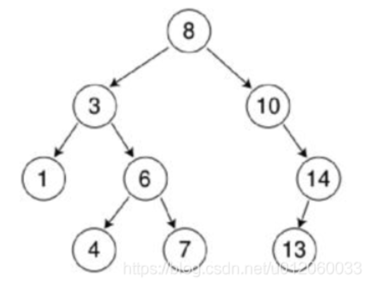

# 二叉树

## 定义

二叉树的定义：二叉树是每个结点最多只能有两个分支的树，左边的分支称为左子树，右边的分支称为右子树。

抄的一道题目

```java
public class TreeNode {
     int val;
     TreeNode left;
     TreeNode right;
     TreeNode() {}
     TreeNode(int val) { this.val = val; }
     TreeNode(int val, TreeNode left, TreeNode right) {
         this.val = val;
         this.left = left;
         this.right = right;
     }
 }
```

## 种类

1. **满二叉树（Full Binary Tree）：**

   

   - 在满二叉树中，每个节点都有零或两个子节点。所有叶子节点都在同一层，每一层的节点数都是满的。
   - 非叶子结点的度(`结点`拥有的`子树数目`称为结点的`度`)一定是2
   - 在同样深度的二叉树中，满二叉树的结点个数最多，叶子数最多

2. **完全二叉树（Complete Binary Tree）：**

   

   - 在完全二叉树中，除了最后一层，其他每一层的节点都被完全填充，最后一层的节点尽量靠左排列。

3. **二叉搜索树（Binary Search Tree，BST）：**

   

   - 在二叉搜索树中，对于每个节点，其左子树的所有节点的值都小于它的值，而右子树的所有节点的值都大于它的值。这使得在 BST 中可以快速地执行查找、插入和删除操作。

4. **平衡二叉树（Balanced Binary Tree / AVL Tree）：**

   - 平衡二叉树是一种特殊的二叉搜索树，它的左右子树高度差不超过 1。平衡二叉树的目的是保持树的高度较小，以确保高效的查找、插入和删除操作。

## 特点

1. 在非空二叉树中，第层结点总数不超过，

2. 深度为的二叉树最多有个个结点（），最少有个结点

3. 对于任意一颗二叉树，如果叶结点数为，而度数为2的结点总数为，则=

## 存储方式

1. 顺序存储
   - 使用数组来表示二叉树，按照某种规律将树的节点存储在数组中。
   - 对于二叉树的第 i 个节点，其左子节点存储在数组的第 2i 个位置，右子节点存储在数组的第 2i+1 个位置。
   - 这种存储方式适用于完全二叉树，但对于非完全二叉树会浪费一些空间。
2. 链式存储
   - 使用节点和指针的链式结构来表示二叉树。
   - 适合多种二叉树。

## 遍历方式

### 前序遍历

1. 递归法

   ```java
   class Solution {
       List<Integer> ans = new ArrayList<>();
       public List<Integer> preorderTraversal(TreeNode root) {
           if(root == null){
               return ans;
           }
           
           ans.add(root.val);
           preorderTraversal(root.left);
           preorderTraversal(root.right);       
           return ans;
       }  
   }
   ```

 2. 迭代法（用栈模拟递归）

    ```java
    class Solution {
        public List<Integer> preorderTraversal(TreeNode root) {
            List<Integer> ans = new ArrayList<>();
            Stack<TreeNode> s = new Stack<>(); 
            if(root == null){
                return ans;
            }
            s.push(root);
            while(!s.isEmpty()){
                TreeNode node = s.pop();
                ans.add(node.val);
                if(node.right != null){
                    s.push(node.right);
                }
                if(node.left != null){
                    s.push(node.left);
                }            
            }
            return ans;
        }
    }
    ```

### 中序遍历

1. 递归法

   ```java
   class Solution {
       List<Integer> ans = new ArrayList<>();
       public List<Integer> inorderTraversal(TreeNode root) {
           if(root == null){
               return ans;
           }
           
           inorderTraversal(root.left);
           ans.add(root.val);
           inorderTraversal(root.right);
           return ans;
       }
   }
   ```

2. 迭代法

   ```java
   class Solution {
       public List<Integer> inorderTraversal(TreeNode root) {
           List<Integer> ans = new ArrayList<>();
           Stack<TreeNode> s = new Stack<>();
           if(root == null){
               return ans;
           }
           
           TreeNode cur = root;
           while(cur != null || !s.isEmpty()){
               if(cur != null){
                   s.push(cur);
                   cur = cur.left;
               } else {
                   cur = s.pop();
                   ans.add(cur.val);
                   cur = cur.right;
               }
           }
           return ans;
       }
   }
   ```

### 后序遍历

前序遍历是：根左右，后序遍历是左右根；可以发现，将前序遍历倒着输出是右左根，所以只需要将前序遍历改成根右左，倒着输出就是后序遍历。

1. 递归法

   ```java
   class Solution {
       List<Integer> ans = new ArrayList<>();
       public List<Integer> postorderTraversal(TreeNode root) {
           if(root == null){
               return ans;
           }
   
           postorderTraversal(root.left);
           postorderTraversal(root.right);
           ans.add(root.val);
           return ans;
       }
   }
   ```

2. 迭代法

   ```java
   class Solution {
       public List<Integer> postorderTraversal(TreeNode root) {
           List<Integer> ans = new ArrayList<>();
           Stack<TreeNode> s = new Stack<>(); 
           if(root == null){
               return ans;
           }
           s.push(root);
           while(!s.isEmpty()){
               TreeNode node = s.pop();
               ans.add(node.val);
               // 和前序的相反
               if(node.left != null){
                   s.push(node.left);
               } 
               if(node.right != null){
                   s.push(node.right);
               }           
           }
           // 反转
           Collections.reverse(ans);
           return ans;
       }
   }
   ```

### 层序遍历

采用广度优先搜索

```java
class Solution {
    public List<List<Integer>> levelOrder(TreeNode root) {
        Queue<TreeNode> q = new LinkedList<>();
        List<List<Integer>> ans = new ArrayList<>();
        if(root == null){
            return ans;
        }
        q.offer(root);

        while(!q.isEmpty()){
            int n = q.size();
            List<Integer> an = new ArrayList<>();
            for(int i = 0; i < n; i ++){
                TreeNode cur = q.poll();
                an.add(cur.val);
                if(cur.left != null){
                    q.offer(cur.left);
                }
                if(cur.right != null){
                    q.offer(cur.right);
                }    
            }
            ans.add(an);
        }
        return ans;
    }
}
```

